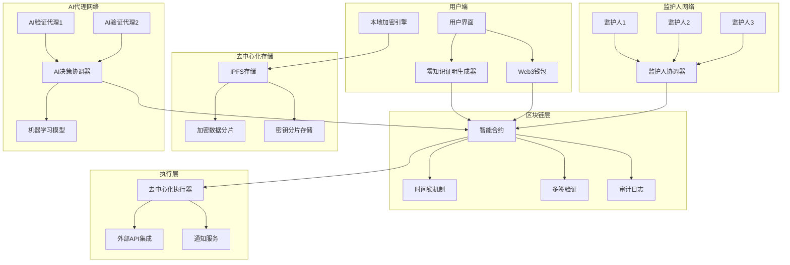
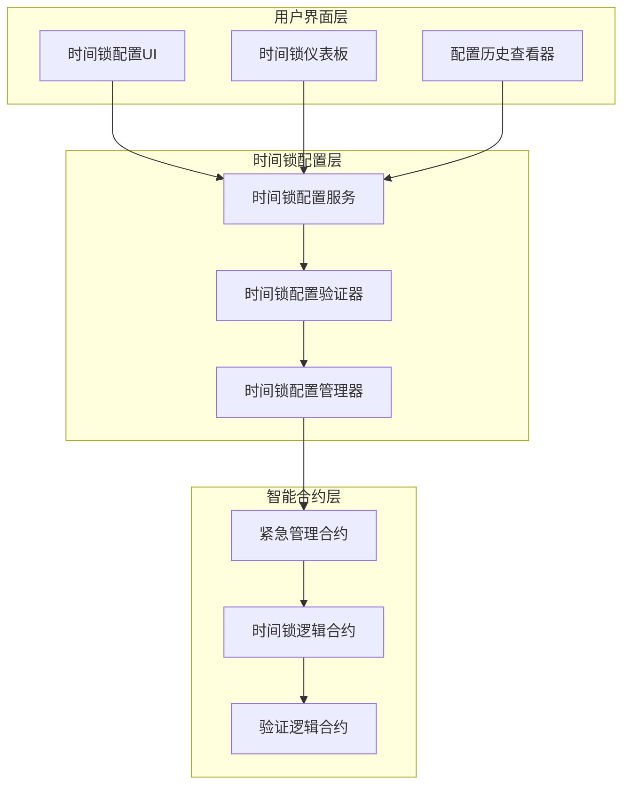
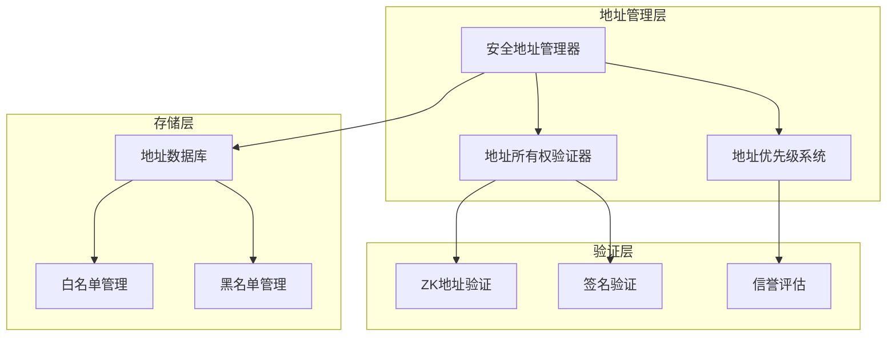
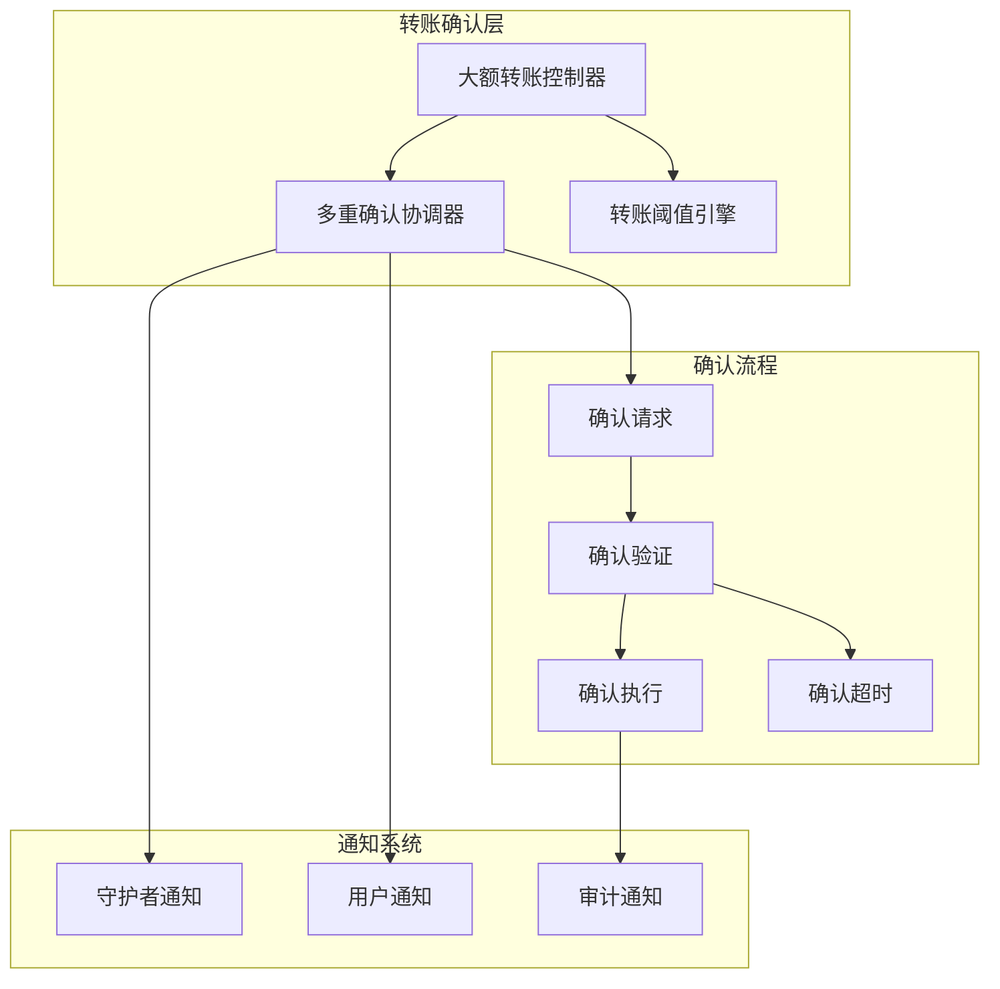
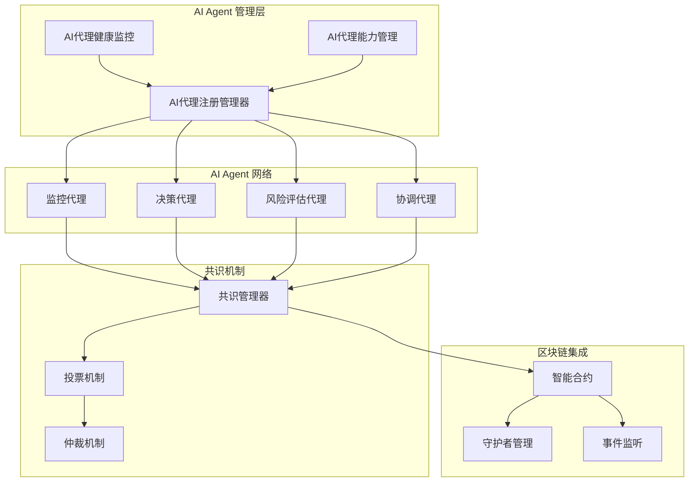
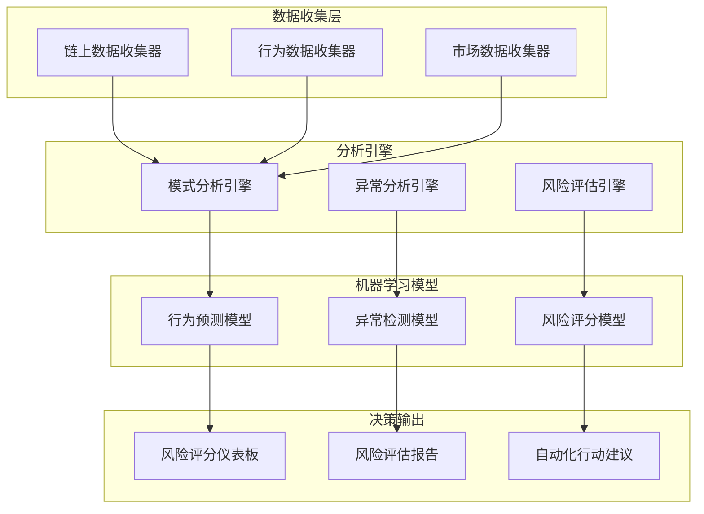
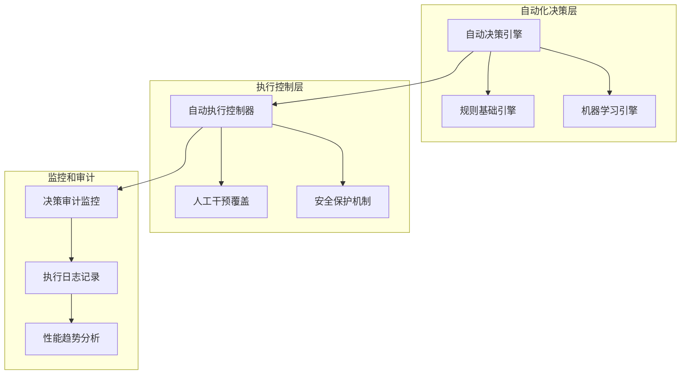
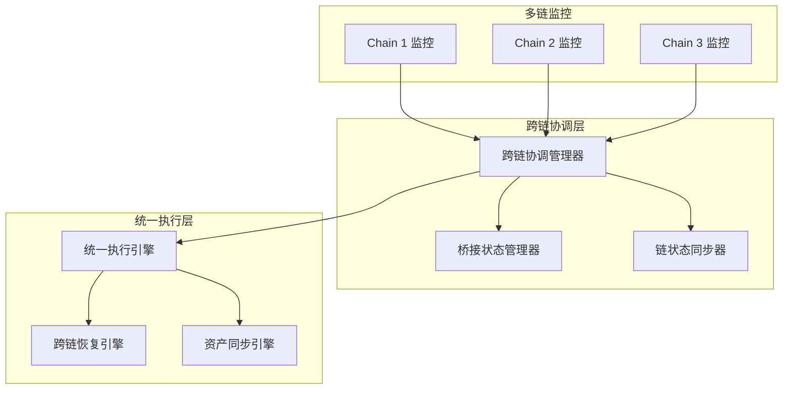

# Design Document: Emergency Guardian

## Overview

Emergency Guardian 是一个基于 Web3 智能合约、零知识证明(ZKP)和 AI 代理的去中心化紧急数据管理系统。系统采用分布式信任模型，通过区块链智能合约管理多签验证流程，使用零知识证明保护隐私，并结合 AI 代理进行智能决策，确保在用户无法自理的紧急情况下，能够安全地访问和执行预设操作。

核心设计原则：

- **去中心化治理**：基于智能合约的自动化治理，无需中心化权威
- **零知识隐私**：使用 ZKP 技术在验证身份和权限的同时保护用户隐私
- **AI 辅助决策**：智能代理分析紧急情况并提供可验证的决策支持
- **多层级安全**：结合时间锁、多签验证和渐进式权限升级
- **可验证透明**：所有操作在区块链上可审计，同时保护敏感信息

## Architecture

### 系统架构图



### 核心组件

1. **智能合约系统 (Smart Contract System)**

   - **紧急管理合约**：管理紧急状态的生命周期和权限升级
   - **多签验证合约**：协调监护人和 AI 代理的验证流程
   - **时间锁合约**：实现基于时间的安全机制和冷却期
   - **资产管理合约**：控制紧急情况下的资金和资源调用

2. **零知识证明模块 (Zero-Knowledge Proof Module)**

   - **身份证明**：在不泄露具体身份信息的情况下证明监护人身份
   - **权限证明**：证明用户对特定资源的访问权限
   - **紧急状态证明**：证明紧急情况的真实性而不暴露具体细节
   - **执行授权证明**：证明操作执行的合法性

3. **AI 代理网络 (AI Agent Network)**

   - **情况分析代理**：分析紧急情况的真实性和严重程度
   - **决策支持代理**：基于预设规则和学习模型提供决策建议
   - **风险评估代理**：评估操作执行的风险和影响
   - **协调代理**：管理多个 AI 代理之间的协作和共识

4. **去中心化存储系统 (Decentralized Storage System)**
   - **IPFS 集成**：存储加密的用户数据和元数据
   - **分片存储**：将数据分片存储在多个节点以提高安全性
   - **冗余备份**：确保数据的可用性和持久性
   - **访问控制**：基于智能合约的去中心化访问控制

## Components and Interfaces

### 智能合约接口

#### EmergencyManagementContract

```solidity
interface IEmergencyManagement {
    // 第一阶段：触发与激活
    function proposeEmergency(bytes calldata evidence, bytes32 evidenceHash) external;
    function cancelEmergencyProposal(uint256 proposalId) external;
    function activateEmergency(uint256 proposalId) external;

    // 第二阶段：支付与容错
    function executePayment(
        PaymentRequest calldata request,
        bytes[] calldata guardianSignatures
    ) external;
    function acknowledgeResolution() external;
    function checkAndAutoEscalate() external;

    // 第三阶段：动态管理
    function proposeGuardianChange(
        address[] calldata newGuardians,
        uint256 newThreshold
    ) external returns (bytes32);
    function executeGuardianChange(
        address[] calldata newGuardians,
        uint256 newThreshold,
        bytes32 proposalHash
    ) external;

    // 事件
    event EmergencyProposed(uint256 indexed proposalId, address indexed proposer);
    event EmergencyActivated(uint256 indexed proposalId, EmergencyLevel level);
    event PaymentExecuted(bytes32 indexed requestId, uint256 amount);
    event ResolutionAcknowledged(address indexed owner);
    event GuardianChanged(address[] newGuardians, uint256 newThreshold);
}

struct PaymentRequest {
    address recipient;
    uint256 amount;
    bytes32 purpose;
    uint256 deadline;
}

enum EmergencyLevel {
    None,
    Level1,  // 初始紧急状态
    Level2,  // 升级紧急状态
    Level3   // 最高紧急状态
}
```

#### ZKProofVerifier

```solidity
interface IZKProofVerifier {
    // 验证监护人身份证明
    function verifyGuardianIdentity(
        bytes calldata proof,
        bytes32 publicInputHash
    ) external view returns (bool);

    // 验证紧急状态证明
    function verifyEmergencyProof(
        bytes calldata proof,
        bytes32 emergencyHash
    ) external view returns (bool);

    // 验证执行权限证明
    function verifyExecutionAuthorization(
        bytes calldata proof,
        address executor,
        bytes32 operationHash
    ) external view returns (bool);
}
```

### 1. 零知识证明组件

#### ZKProofGenerator

```typescript
interface ZKProofGenerator {
  // 生成身份证明
  generateIdentityProof(
    identity: GuardianIdentity,
    challenge: Challenge
  ): Promise<ZKProof>;

  // 生成紧急状态证明
  generateEmergencyProof(
    emergencyData: EmergencyData,
    witnesses: Witness[]
  ): Promise<ZKProof>;

  // 生成执行授权证明
  generateAuthorizationProof(
    authorization: Authorization,
    operation: Operation
  ): Promise<ZKProof>;

  // 验证零知识证明
  verifyProof(proof: ZKProof, publicInputs: PublicInputs): Promise<boolean>;
}
```

#### AIAgentOrchestrator

```typescript
interface AIAgentOrchestrator {
  // 分析紧急情况
  analyzeEmergencySituation(
    context: EmergencyContext,
    evidence: Evidence[]
  ): Promise<EmergencyAssessment>;

  // 生成AI决策
  generateDecision(
    assessment: EmergencyAssessment,
    constraints: DecisionConstraints
  ): Promise<AIDecision>;

  // 协调多个AI代理
  coordinateAgents(
    agents: AIAgent[],
    task: CoordinationTask
  ): Promise<ConsensusResult>;

  // 提供决策解释
  explainDecision(
    decision: AIDecision,
    context: ExplanationContext
  ): Promise<DecisionExplanation>;
}
```

### 2. 区块链集成组件

#### Web3ContractManager

```typescript
interface Web3ContractManager {
  // 部署紧急管理合约
  deployEmergencyContract(config: ContractConfig): Promise<ContractAddress>;

  // 提交紧急提案
  proposeEmergency(
    evidence: Evidence,
    zkProof: ZKProof
  ): Promise<TransactionHash>;

  // 执行多签支付
  executeMultiSigPayment(
    request: PaymentRequest,
    signatures: Signature[]
  ): Promise<TransactionHash>;

  // 监听合约事件
  subscribeToEvents(
    eventTypes: EventType[],
    callback: EventCallback
  ): Promise<Subscription>;
}
```

#### DecentralizedStorageManager

```typescript
interface DecentralizedStorageManager {
  // 上传加密数据到IPFS
  uploadEncryptedData(
    data: EncryptedData,
    metadata: StorageMetadata
  ): Promise<IPFSHash>;

  // 从IPFS检索数据
  retrieveEncryptedData(hash: IPFSHash): Promise<EncryptedData>;

  // 分片存储密钥
  storeKeyShards(
    shards: KeyShard[],
    distributionStrategy: DistributionStrategy
  ): Promise<StorageReceipt[]>;

  // 重构密钥分片
  reconstructKeyFromShards(
    shardReferences: ShardReference[]
  ): Promise<ReconstructedKey>;
}
```

### 3. 执行和通知组件

#### DecentralizedExecutor

```typescript
interface DecentralizedExecutor {
  // 解析智能合约指令
  parseContractInstructions(contractData: ContractData): Promise<ExecutionPlan>;

  // 执行去中心化操作
  executeDecentralizedOperation(
    operation: DecentralizedOperation,
    authorization: BlockchainAuthorization
  ): Promise<ExecutionResult>;

  // 与外部DeFi协议交互
  interactWithDeFiProtocol(
    protocol: DeFiProtocol,
    operation: DeFiOperation
  ): Promise<DeFiResult>;

  // 跨链操作执行
  executeCrossChainOperation(
    sourceChain: ChainId,
    targetChain: ChainId,
    operation: CrossChainOperation
  ): Promise<CrossChainResult>;
}
```

## Data Models

### 区块链和智能合约数据结构

```typescript
// 紧急提案模型
interface EmergencyProposal {
  proposalId: uint256;
  proposer: address;
  evidence: bytes;
  evidenceHash: bytes32;
  proposedAt: uint256;
  timelock: uint256;
  status: ProposalStatus;
  level: EmergencyLevel;
}

// 监护人配置模型
interface GuardianConfig {
  guardians: address[];
  threshold: uint256;
  lastUpdated: uint256;
  changeProposalHash: bytes32;
}

// 支付请求模型
interface PaymentRequest {
  requestId: bytes32;
  recipient: address;
  amount: uint256;
  purpose: bytes32;
  deadline: uint256;
  signatures: bytes[];
  executed: boolean;
}
```

### 零知识证明数据结构

```typescript
// ZK证明模型
interface ZKProof {
  proofType: ProofType;
  proof: ArrayBuffer;
  publicInputs: PublicInputs;
  verificationKey: VerificationKey;
  circuit: CircuitIdentifier;
  timestamp: Date;
}

// 身份证明数据
interface IdentityProof {
  guardianId: string;
  identityCommitment: string;
  nullifierHash: string;
  proof: ZKProof;
  challenge: Challenge;
}

// 紧急状态证明数据
interface EmergencyStateProof {
  emergencyHash: string;
  severityLevel: number;
  evidenceCommitment: string;
  witnessCommitments: string[];
  proof: ZKProof;
}

// 执行授权证明数据
interface ExecutionAuthorizationProof {
  operationHash: string;
  executorCommitment: string;
  permissionLevel: number;
  resourceCommitments: string[];
  proof: ZKProof;
}
```

### AI 代理和决策数据结构

```typescript
// AI决策模型
interface AIDecision {
  decisionId: string;
  agentId: string;
  decisionType: DecisionType;
  confidence: number;
  reasoning: ReasoningPath[];
  evidence: EvidenceAnalysis[];
  recommendations: Recommendation[];
  timestamp: Date;
  signature: AISignature;
}

// 紧急情况评估模型
interface EmergencyAssessment {
  assessmentId: string;
  emergencyType: EmergencyType;
  severityScore: number;
  urgencyLevel: UrgencyLevel;
  riskFactors: RiskFactor[];
  mitigationStrategies: MitigationStrategy[];
  confidence: number;
  analysisMetadata: AnalysisMetadata;
}

// AI代理协调结果
interface ConsensusResult {
  consensusId: string;
  participatingAgents: string[];
  consensusType: ConsensusType;
  agreement: boolean;
  confidence: number;
  dissenting: DissentingOpinion[];
  finalDecision: AIDecision;
}
```

### 核心用户和系统数据结构

```typescript
// 增强的用户数据模型
interface UserData {
  userId: string;
  walletAddress: address;
  personalInfo: EncryptedPersonalInfo;
  emergencyContacts: GuardianInfo[];
  presetOperations: BlockchainOperation[];
  defiPositions: DeFiPosition[];
  crossChainAssets: CrossChainAsset[];
  zkIdentityCommitment: string;
  metadata: UserMetadata;
}

// 监护人信息模型
interface GuardianInfo {
  guardianId: string;
  walletAddress: address;
  name: string; // 加密存储
  relationship: string;
  verificationMethods: VerificationMethod[];
  trustLevel: TrustLevel;
  zkIdentityCommitment: string;
  publicKey: CryptoKey;
  lastActive: Date;
}

// 区块链操作模型
interface BlockchainOperation {
  operationId: string;
  type: OperationType;
  targetContract: address;
  functionCall: FunctionCall;
  parameters: OperationParameters;
  conditions: ExecutionCondition[];
  gasLimit: uint256;
  priority: number;
  crossChain: boolean;
  targetChain?: ChainId;
}

// DeFi位置模型
interface DeFiPosition {
  positionId: string;
  protocol: DeFiProtocol;
  tokenAddress: address;
  amount: uint256;
  stakingRewards: uint256;
  liquidityPoolShare: uint256;
  lockupPeriod: uint256;
  emergencyWithdrawable: boolean;
}

// 跨链资产模型
interface CrossChainAsset {
  assetId: string;
  sourceChain: ChainId;
  targetChain: ChainId;
  tokenAddress: address;
  bridgeContract: address;
  amount: uint256;
  bridgeStatus: BridgeStatus;
  emergencyRecoverable: boolean;
}
```

### 去中心化存储数据结构

```typescript
// IPFS存储引用模型
interface IPFSStorageReference {
  hash: string;
  size: number;
  encryptionMethod: EncryptionMethod;
  shardingStrategy: ShardingStrategy;
  redundancyLevel: number;
  pinningNodes: string[];
  accessControlList: AccessControl[];
}

// 分片存储模型
interface ShardedStorage {
  shardId: string;
  totalShards: number;
  shardIndex: number;
  shardHash: string;
  storageNodes: StorageNode[];
  reconstructionThreshold: number;
  integrityProof: IntegrityProof;
}

// 存储节点模型
interface StorageNode {
  nodeId: string;
  nodeAddress: string;
  reputation: number;
  availability: number;
  storageCapacity: number;
  geographicLocation: string;
  lastPing: Date;
}
```

### 安全和审计数据结构

```typescript
// 区块链审计日志模型
interface BlockchainAuditLog {
  logId: string;
  blockNumber: uint256;
  transactionHash: bytes32;
  eventType: AuditEventType;
  actor: address;
  action: string;
  resource: string;
  result: ActionResult;
  gasUsed: uint256;
  timestamp: uint256;
  zkProof?: ZKProof;
}

// 多签验证记录
interface MultiSigVerificationRecord {
  verificationId: string;
  requiredSignatures: number;
  receivedSignatures: Signature[];
  threshold: number;
  status: VerificationStatus;
  timeWindow: TimeWindow;
  participants: address[];
  zkProofs: ZKProof[];
}

// 时间锁状态模型
interface TimelockState {
  proposalId: uint256;
  proposalHash: bytes32;
  eta: uint256; // 执行时间
  executed: boolean;
  cancelled: boolean;
  proposer: address;
  targets: address[];
  values: uint256[];
  signatures: string[];
  calldatas: bytes[];
}
```

## Correctness Properties

_A property is a characteristic or behavior that should hold true across all valid executions of a system-essentially, a formal statement about what the system should do. Properties serve as the bridge between human-readable specifications and machine-verifiable correctness guarantees._

基于需求分析和属性反思，以下是 Emergency Guardian 系统的核心正确性属性：

### Property 1: 加密数据完整性和算法强度

_For any_ 用户数据，系统应该使用强加密算法（AES-256-GCM）在本地加密，创建有效的加密包，且加密后再解密应该产生与原始数据等价的结果
**Validates: Requirements 1.1, 1.2, 6.1**

### Property 2: 数据上传和访问凭证往返

_For any_ 成功的加密包上传操作，系统应该安全传输数据并返回有效的访问凭证，且该凭证能够用于后续的数据访问
**Validates: Requirements 1.3, 1.4**

### Property 3: 联系人管理一致性和约束

_For any_ 紧急联系人管理操作（添加、修改、删除），系统状态应该正确反映操作结果，验证联系人信息，并始终维持至少两个有效联系人的约束
**Validates: Requirements 2.1, 2.2, 2.3, 2.4**

### Property 4: 紧急流程触发和通知

_For any_ 紧急情况触发（自动检测或手动激活），系统应该验证触发者身份，立即启动验证流程，并通知所有预设的紧急联系人
**Validates: Requirements 3.1, 3.2, 3.3**

### Property 5: 多方验证协调和授权

_For any_ 紧急验证会话，系统必须要求所有必要参与方（紧急联系人和 AI 代理）提供有效验证，验证身份和授权，评估紧急情况，且只有当验证通过时才授权解密，验证失败时拒绝访问
**Validates: Requirements 4.1, 4.2, 4.3, 4.4, 4.5**

### Property 6: 操作执行权限控制

_For any_ 预设操作执行请求，系统应该只在多签验证通过后解密数据、解析操作指令并执行操作，且所有操作必须在用户预设的权限范围内
**Validates: Requirements 5.1, 5.2, 5.3, 5.5**

### Property 7: 审计日志完整性

_For any_ 关键系统操作（紧急触发、验证、解密、操作执行），系统应该创建不可篡改的审计日志记录，并在操作完成后通知相关方
**Validates: Requirements 3.4, 5.4, 6.2**

### Property 8: 异常检测和安全响应

_For any_ 检测到的异常行为，系统应该触发安全警报并暂停相关操作，防止潜在的安全威胁
**Validates: Requirements 6.3**

### Property 9: 数据备份和完整性验证

_For any_ 关键数据，系统应该定期创建备份并验证备份完整性，确保数据的可恢复性
**Validates: Requirements 6.4**

### Property 10: 审计报告生成

_For any_ 用户的审计报告请求，系统应该生成包含详细操作历史的报告
**Validates: Requirements 6.5**

### Property 11: 界面状态同步

_For any_ 系统状态变化，用户界面应该实时反映这些变化，确保用户看到的信息是最新的
**Validates: Requirements 7.3**

### Web3 和 ZKP 特定属性

### Property 12: 智能合约状态一致性

_For any_ 智能合约操作（提案创建、验证、执行），区块链状态应该正确反映操作结果，且状态转换应该遵循预定义的状态机规则
**Validates: Web3 contract state management**

### Property 13: 零知识证明验证

_For any_ 生成的零知识证明（身份证明、紧急状态证明、执行授权证明），证明应该在不泄露敏感信息的情况下成功验证相应的声明
**Validates: ZKP privacy protection**

### Property 14: 多签时间锁机制

_For any_ 需要时间锁的操作，系统应该在时间锁期间允许取消，时间锁到期后允许执行，且在执行前验证所有必要的签名
**Validates: Timelock and multi-signature security**

### Property 15: 跨链操作一致性

_For any_ 跨链资产操作，系统应该确保源链和目标链的状态一致性，并在操作失败时提供恢复机制
**Validates: Cross-chain asset management**

### Property 16: AI 代理共识机制

_For any_ 需要多个 AI 代理参与的决策，系统应该通过共识机制达成一致决策，并提供可解释的决策理由
**Validates: AI agent coordination and consensus**

## Error Handling

### 区块链和智能合约错误

1. **交易失败错误**

   - 当智能合约交易因 gas 不足、revert 或其他原因失败时，系统应重试或提供替代方案
   - 记录失败原因并通知用户
   - 实施指数退避重试策略

2. **时间锁违规错误**

   - 当尝试在时间锁期间执行操作时，系统应拒绝执行并返回剩余时间
   - 提供时间锁状态查询接口
   - 在时间锁到期时自动通知相关方

3. **多签阈值不足错误**
   - 当收集到的签名数量低于要求阈值时，系统应拒绝执行并请求更多签名
   - 显示当前签名状态和缺失的签名方
   - 设置签名收集超时机制

### 零知识证明错误

4. **证明生成失败错误**

   - 当 ZK 证明生成因电路错误、输入无效或计算资源不足失败时，系统应提供详细错误信息
   - 实施证明生成重试机制
   - 提供证明生成进度反馈

5. **证明验证失败错误**

   - 当 ZK 证明验证失败时，系统应拒绝相关操作并记录验证失败事件
   - 区分证明格式错误、公共输入不匹配和恶意证明
   - 实施证明验证缓存以提高性能

6. **电路兼容性错误**
   - 当使用的 ZK 电路版本不兼容时，系统应提供电路升级路径
   - 维护电路版本兼容性矩阵
   - 支持多版本电路并行运行

### AI 代理和决策错误

7. **AI 代理不可达错误**

   - 当 AI 代理无法响应或离线时，启用备用 AI 代理或降级决策模式
   - 实施 AI 代理健康检查机制
   - 记录代理可用性统计信息

8. **决策共识失败错误**

   - 当多个 AI 代理无法达成共识时，实施仲裁机制或人工干预
   - 提供决策分歧的详细分析
   - 支持决策权重调整和优先级设置

9. **模型推理错误**
   - 当 AI 模型推理失败或产生异常结果时，回退到规则基础决策
   - 实施模型输出验证和异常检测
   - 提供模型性能监控和告警

### 去中心化存储错误

10. **IPFS 节点不可达错误**

    - 当 IPFS 节点无法访问时，尝试从其他节点检索数据
    - 实施数据冗余存储和自动故障转移
    - 监控节点健康状态和网络连接

11. **数据分片丢失错误**

    - 当部分数据分片丢失时，使用纠删码恢复数据
    - 实施主动数据修复和重新分片
    - 维护分片完整性检查和告警

12. **存储配额超限错误**
    - 当存储空间不足时，实施数据压缩或清理策略
    - 提供存储使用统计和预警
    - 支持动态存储扩展和负载均衡

### 跨链操作错误

13. **跨链桥接失败错误**

    - 当跨链资产转移失败时，提供资产恢复机制
    - 实施跨链交易状态跟踪和超时处理
    - 支持多种桥接协议的故障转移

14. **链状态不一致错误**
    - 当检测到不同链上的状态不一致时，暂停相关操作并启动状态同步
    - 实施状态一致性检查和自动修复
    - 提供手动状态调解接口

### 传统系统错误（保留并增强）

15. **加密/解密失败错误**

    - 增强密钥管理和硬件安全模块集成
    - 支持多种加密算法的故障转移
    - 实施密钥轮换和安全删除

16. **网络连接错误**

    - 增强 P2P 网络连接和 NAT 穿透
    - 支持多种网络协议的自动切换
    - 实施网络质量监控和优化

17. **权限和访问控制错误**
    - 集成基于角色的访问控制(RBAC)和属性基础访问控制(ABAC)
    - 支持动态权限调整和临时授权
    - 实施权限审计和合规检查

## Testing Strategy

### 双重测试方法

Emergency Guardian 系统采用单元测试和基于属性的测试相结合的综合测试策略：

**单元测试**：

- 验证特定示例和边界情况
- 测试组件间的集成点
- 验证错误条件和异常处理
- 测试具体的加密算法和智能合约函数实现

**基于属性的测试**：

- 验证跨所有输入的通用属性
- 通过随机化实现全面的输入覆盖
- 测试系统在各种条件下的行为一致性
- 验证密码学协议和区块链状态转换的正确性

### 基于属性的测试配置

**测试框架选择**：

- **JavaScript/TypeScript**: fast-check 用于基于属性的测试
- **Solidity**: Foundry 的 forge 用于智能合约属性测试
- **零知识证明**: Circom 和 snarkjs 用于电路测试

**测试配置要求**：

- 每个属性测试最少运行 100 次迭代
- 智能合约测试使用 fuzz testing 运行 1000+ 次
- 每个测试必须引用其对应的设计文档属性
- 标签格式：**Feature: emergency-guardian, Property {number}: {property_text}**

### Web3 和区块链测试

1. **智能合约测试**

   - **状态转换测试**: 验证合约状态机的正确转换
   - **权限控制测试**: 测试访问控制和权限边界
   - **时间锁测试**: 验证时间锁机制的正确性
   - **多签验证测试**: 测试多签名验证逻辑
   - **Gas 优化测试**: 验证操作的 gas 消耗在合理范围内

2. **跨链操作测试**

   - **桥接一致性测试**: 验证跨链资产转移的一致性
   - **状态同步测试**: 测试多链状态同步机制
   - **故障恢复测试**: 验证跨链操作失败时的恢复机制

3. **去中心化存储测试**
   - **IPFS 集成测试**: 验证数据存储和检索的正确性
   - **分片冗余测试**: 测试数据分片和冗余机制
   - **节点故障测试**: 验证存储节点故障时的数据可用性

### 零知识证明测试

4. **电路正确性测试**

   - **约束满足测试**: 验证 ZK 电路约束的正确性
   - **证明生成测试**: 测试各种输入下的证明生成
   - **验证一致性测试**: 确保证明验证的一致性
   - **隐私保护测试**: 验证证明不泄露敏感信息

5. **证明系统集成测试**
   - **端到端证明测试**: 从生成到验证的完整流程测试
   - **批量验证测试**: 测试批量证明验证的性能和正确性
   - **电路升级测试**: 验证电路版本升级的兼容性

### AI 代理测试

6. **决策正确性测试**

   - **决策一致性测试**: 验证相同输入产生一致决策
   - **共识机制测试**: 测试多代理共识算法
   - **异常检测测试**: 验证 AI 代理的异常检测能力
   - **可解释性测试**: 确保 AI 决策具有可解释性

7. **代理协调测试**
   - **负载均衡测试**: 测试代理间的负载分配
   - **故障转移测试**: 验证代理故障时的自动切换
   - **性能基准测试**: 建立 AI 代理性能基线

### 安全和渗透测试

8. **密码学安全测试**

   - **加密强度测试**: 验证加密算法的安全性
   - **密钥管理测试**: 测试密钥生成、存储和销毁
   - **随机数质量测试**: 验证随机数生成器的质量
   - **侧信道攻击测试**: 测试对时间攻击等的防护

9. **智能合约安全测试**

   - **重入攻击测试**: 验证对重入攻击的防护
   - **整数溢出测试**: 测试数值计算的安全性
   - **权限提升测试**: 验证权限控制的严密性
   - **前端运行攻击测试**: 测试对 MEV 攻击的防护

10. **系统级安全测试**
    - **拒绝服务攻击测试**: 验证系统的抗 DDoS 能力
    - **数据完整性攻击测试**: 测试对数据篡改的检测
    - **隐私泄露测试**: 验证用户隐私的保护

### 性能和压力测试

11. **区块链性能测试**

    - **交易吞吐量测试**: 测试系统的 TPS 上限
    - **网络延迟测试**: 验证在高延迟网络下的性能
    - **节点扩展测试**: 测试系统的水平扩展能力

12. **存储性能测试**
    - **大文件处理测试**: 测试大型加密包的处理能力
    - **并发访问测试**: 验证高并发下的存储性能
    - **数据恢复性能测试**: 测试数据恢复的速度

### 测试数据生成策略

**智能生成器设计**：

- **区块链数据生成器**: 生成有效和无效的交易、区块和状态
- **ZK 证明生成器**: 创建各种类型的证明和验证场景
- **AI 决策生成器**: 模拟各种紧急情况和决策场景
- **跨链操作生成器**: 生成复杂的跨链交互场景

**边界条件覆盖**：

- **Gas 限制边界**: 测试接近 gas 限制的交易
- **时间锁边界**: 测试时间锁的临界时间点
- **多签阈值边界**: 测试签名数量的边界情况
- **存储容量边界**: 测试存储系统的容量限制

### 测试环境和工具

**测试网络配置**：

- **本地测试网**: 使用 Hardhat/Foundry 进行快速迭代测试
- **公共测试网**: 在 Goerli/Sepolia 等测试网进行集成测试
- **分叉测试**: 使用主网分叉进行真实环境模拟

**监控和分析工具**：

- **测试覆盖率**: 使用 solidity-coverage 等工具监控代码覆盖率
- **性能分析**: 使用区块链分析工具监控性能指标
- **安全扫描**: 集成 Slither、MythX 等安全分析工具

### 持续集成和部署测试

**自动化测试流水线**：

- **代码提交触发**: 每次代码提交自动运行单元测试
- **合并请求验证**: PR 合并前运行完整测试套件
- **部署前验证**: 部署到生产环境前运行安全和性能测试

**测试报告和监控**：

- **实时测试仪表板**: 显示测试执行状态和结果
- **性能趋势分析**: 跟踪系统性能的长期趋势
- **安全告警系统**: 在检测到安全问题时立即告警

## Phase 2: Advanced Features Architecture

### 用户配置功能升级架构

#### 时间锁配置系统



**核心组件设计**：

- **TimelockConfigManager**: 管理用户自定义时间锁配置
- **DynamicTimelockAdjuster**: 基于风险评分动态调整时间锁
- **TimelockValidationEngine**: 验证时间锁配置的合理性和安全性

#### 安全地址管理系统



**核心功能**：

- **地址所有权验证**: 使用 ZK 证明验证地址控制权
- **智能地址推荐**: 基于紧急类型和安全评估推荐最优地址
- **地址信誉系统**: 维护地址安全评分和历史记录

#### 大额转账确认机制



### AI Agent 集成架构

#### AI Agent 守护者系统



**AI Agent 类型和功能**：

1. **监控代理 (Monitoring Agent)**

   - 24/7 钱包活动监控
   - 异常交易模式识别
   - 实时风险评估

2. **决策代理 (Decision Agent)**

   - 紧急情况分析
   - 决策建议生成
   - 操作执行建议

3. **风险评估代理 (Risk Assessment Agent)**

   - 动态风险评分计算
   - 行为模式学习
   - 预测性风险分析

4. **协调代理 (Coordination Agent)**
   - 多代理协调
   - 共识达成
   - 冲突解决

#### 动态风险评估系统



**风险评估维度**：

- **交易行为风险**: 异常交易金额、频率、时间模式
- **地址关联风险**: 与已知风险地址的交互
- **市场环境风险**: DeFi 协议风险、市场波动性
- **时间模式风险**: 非正常时间的活动
- **地理位置风险**: IP 地址和地理位置异常

### 高级功能架构设计 (Future Iterations)

#### 智能自动化决策系统



#### 跨链紧急响应系统



### 新增数据模型

#### 用户配置数据模型

```typescript
// 时间锁配置模型
interface TimelockConfig {
  userId: string;
  emergencyTimelock: number; // 1小时-7天
  guardianChangeTimelock: number; // 24小时-30天
  gracePeriod: number; // 1小时-7天
  levelSpecificTimelocks: Map<EmergencyLevel, number>;
  dynamicAdjustmentEnabled: boolean;
  riskBasedAdjustment: RiskAdjustmentConfig;
  lastUpdated: Date;
}

// 安全地址管理模型
interface SafeAddressConfig {
  userId: string;
  addresses: SafeAddress[];
  defaultAddress: string;
  autoSelectionEnabled: boolean;
  verificationRequired: boolean;
  lastUpdated: Date;
}

interface SafeAddress {
  address: string;
  label: string;
  priority: number;
  addressType: AddressType; // WALLET, EXCHANGE, COLD_STORAGE
  ownershipProof: ZKProof;
  safetyScore: number;
  lastVerified: Date;
}

// 大额转账配置模型
interface LargeTransferConfig {
  userId: string;
  thresholdAmount: number; // 默认100 ETH
  requiredConfirmations: number;
  confirmationWindow: number; // 24小时
  autoExecutionEnabled: boolean;
  notificationSettings: NotificationConfig;
}
```

#### AI Agent 数据模型

```typescript
// AI Agent 注册模型
interface AIAgentRegistration {
  agentId: string;
  agentType: AIAgentType;
  capabilities: AgentCapability[];
  endpoint: string;
  publicKey: string;
  reputation: number;
  performanceMetrics: PerformanceMetrics;
  registrationDate: Date;
  lastActive: Date;
  status: AgentStatus;
}

// 风险评估模型
interface RiskAssessment {
  assessmentId: string;
  userId: string;
  riskScore: number; // 0-100
  riskFactors: RiskFactor[];
  behaviorAnalysis: BehaviorAnalysis;
  recommendations: RiskRecommendation[];
  confidence: number;
  timestamp: Date;
  validUntil: Date;
}

// AI决策模型
interface AIDecisionRecord {
  decisionId: string;
  agentId: string;
  decisionType: DecisionType;
  inputData: DecisionInput;
  outputDecision: Decision;
  confidence: number;
  reasoning: ReasoningPath[];
  executionResult?: ExecutionResult;
  humanOverride?: HumanOverride;
  timestamp: Date;
}
```

### 新增正确性属性

#### Phase 2 特定属性

**Property 17: 时间锁配置安全性**
_For any_ 时间锁配置更新，系统应该验证配置参数在安全范围内，正确应用配置，并在风险评分变化时动态调整时间锁期限
**Validates: 用户配置功能的安全性**

**Property 18: 安全地址管理一致性**
_For any_ 安全地址管理操作，系统应该验证地址所有权，维护地址优先级和标签的一致性，并确保默认地址选择的正确性
**Validates: 安全地址管理的完整性**

**Property 19: 大额转账确认机制**
_For any_ 大额转账请求，系统应该根据阈值要求适当的确认数量，在确认窗口内收集签名，并在满足条件时自动执行或超时取消
**Validates: 大额转账的安全性和可靠性**

**Property 20: AI Agent 决策一致性**
_For any_ AI Agent 决策过程，相同输入应该产生一致的决策结果，决策应该具有可解释性，并且多 Agent 共识应该收敛到合理结果
**Validates: AI Agent 系统的可靠性**

**Property 21: 风险评估准确性**
_For any_ 风险评估计算，系统应该基于准确的数据分析生成合理的风险评分，检测异常行为模式，并提供有价值的风险建议
**Validates: 风险评估系统的准确性**

**Property 22: AI Agent 协作正确性**
_For any_ 多 Agent 协作任务，系统应该正确协调各 Agent 的工作，处理 Agent 故障和网络分区，并确保协作结果的一致性
**Validates: AI Agent 协作机制的正确性**

### 系统演进路线图

#### Phase 2A: 用户配置功能 (4-6 周)

- 实现灵活的时间锁配置系统
- 构建安全地址管理和验证机制
- 添加大额转账多重确认流程

#### Phase 2B: AI Agent 集成 (6-8 周)

- 扩展守护者类型支持 AI Agent
- 实现 AI Agent 注册、管理和监控
- 构建动态风险评估和智能决策系统

#### Phase 3: 高级自动化 (8-12 周)

- 实现端到端自动化紧急响应
- 构建智能地址选择和跨链支持
- 添加 DAO 治理和保险集成

这个架构设计确保了系统的可扩展性、安全性和用户友好性，同时为未来的高级功能奠定了坚实的基础。
