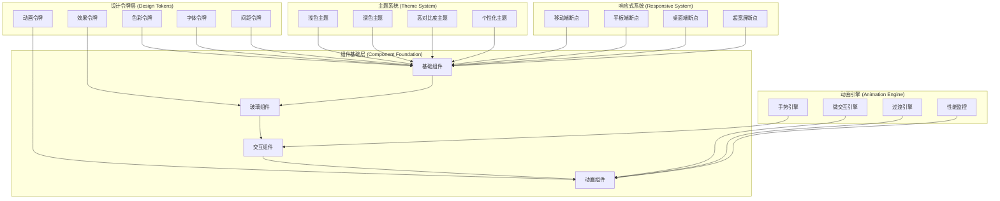

# Design Document: UI Beautification

## Overview

UI Beautification 系统是对现有 Emergency Guardian 界面的全面美化升级，采用现代化的设计语言和 Web3 特有的视觉风格。设计基于玻璃拟态（Glassmorphism）美学，结合微交互、深度层次和智能动画，创造出既专业又富有科技感的用户体验。

核心设计原则：

- **现代玻璃美学**：透明度、模糊效果和分层设计创造深度感
- **智能微交互**：细腻的动画反馈提升用户参与感
- **Web3 视觉语言**：发光效果、渐变和科技感元素
- **无障碍优先**：确保所有用户都能获得优质体验
- **性能导向**：美观与性能的完美平衡

## Architecture

### 设计系统架构图



### 核心架构组件

1. **设计令牌系统 (Design Token System)**

   - **色彩令牌**：扩展的色彩系统，包含透明度和发光变体
   - **字体令牌**：字体大小、行高、字重的系统化定义
   - **间距令牌**：一致的间距和尺寸规范
   - **动画令牌**：标准化的动画时长、缓动函数
   - **效果令牌**：阴影、模糊、渐变等视觉效果

2. **玻璃拟态组件系统 (Glassmorphism Component System)**

   - **玻璃卡片**：具有透明度和模糊效果的容器组件
   - **玻璃按钮**：交互式玻璃效果按钮
   - **玻璃导航**：透明导航栏和侧边栏
   - **玻璃模态框**：层叠的玻璃效果对话框

3. **微交互引擎 (Micro-interaction Engine)**
   - **悬停效果**：鼠标悬停时的视觉反馈
   - **点击反馈**：按钮和链接的点击动画
   - **状态转换**：组件状态变化的平滑过渡
   - **加载动画**：优雅的加载状态指示

## Components and Interfaces

### 设计令牌接口

#### ColorTokens

```typescript
interface ColorTokens {
  // 基础色彩系统
  primary: ColorScale;
  emergency: ColorScale;
  success: ColorScale;
  warning: ColorScale;

  // 玻璃拟态专用色彩
  glass: {
    background: string;
    border: string;
    shadow: string;
    highlight: string;
  };

  // 发光效果色彩
  glow: {
    blue: string;
    red: string;
    green: string;
    purple: string;
  };

  // 透明度变体
  alpha: {
    5: string; // 5% 透明度
    10: string; // 10% 透明度
    20: string; // 20% 透明度
    40: string; // 40% 透明度
    60: string; // 60% 透明度
    80: string; // 80% 透明度
  };
}

interface ColorScale {
  50: string;
  100: string;
  200: string;
  300: string;
  400: string;
  500: string;
  600: string;
  700: string;
  800: string;
  900: string;
  950: string;
}
```

#### EffectTokens

```typescript
interface EffectTokens {
  // 阴影系统
  shadows: {
    soft: string;
    medium: string;
    large: string;
    "glow-blue": string;
    "glow-red": string;
    "glow-green": string;
    "glow-purple": string;
  };

  // 模糊效果
  blur: {
    sm: string; // 4px
    md: string; // 8px
    lg: string; // 16px
    xl: string; // 24px
    "2xl": string; // 40px
  };

  // 渐变效果
  gradients: {
    "glass-light": string;
    "glass-dark": string;
    "primary-glow": string;
    "emergency-glow": string;
    "success-glow": string;
  };

  // 边框效果
  borders: {
    glass: string;
    glow: string;
    highlight: string;
  };
}
```

### 玻璃拟态组件接口

#### GlassCard

```typescript
interface GlassCardProps {
  variant?: "light" | "medium" | "heavy";
  glow?: "blue" | "red" | "green" | "purple" | "none";
  blur?: "sm" | "md" | "lg" | "xl";
  border?: boolean;
  shadow?: "soft" | "medium" | "large";
  className?: string;
  children: React.ReactNode;

  // 交互属性
  hoverable?: boolean;
  clickable?: boolean;

  // 动画属性
  animateOnMount?: boolean;
  animationDelay?: number;
}

interface GlassCardComponent extends React.FC<GlassCardProps> {
  Header: React.FC<GlassCardHeaderProps>;
  Body: React.FC<GlassCardBodyProps>;
  Footer: React.FC<GlassCardFooterProps>;
}
```

#### GlassButton

```typescript
interface GlassButtonProps {
  variant?: "primary" | "secondary" | "emergency" | "success" | "ghost";
  size?: "sm" | "md" | "lg" | "xl";
  glow?: boolean;
  ripple?: boolean;
  loading?: boolean;
  disabled?: boolean;

  // 玻璃效果属性
  glassIntensity?: "light" | "medium" | "heavy";

  // 事件处理
  onClick?: (event: React.MouseEvent) => void;
  onHover?: (isHovered: boolean) => void;

  // 内容
  children: React.ReactNode;
  leftIcon?: React.ReactNode;
  rightIcon?: React.ReactNode;
}
```

### 动画系统接口

#### AnimationEngine

```typescript
interface AnimationEngine {
  // 微交互动画
  createHoverAnimation(element: HTMLElement, config: HoverConfig): Animation;
  createClickAnimation(element: HTMLElement, config: ClickConfig): Animation;
  createFocusAnimation(element: HTMLElement, config: FocusConfig): Animation;

  // 过渡动画
  createEnterAnimation(element: HTMLElement, config: EnterConfig): Animation;
  createExitAnimation(element: HTMLElement, config: ExitConfig): Animation;
  createMorphAnimation(
    from: HTMLElement,
    to: HTMLElement,
    config: MorphConfig
  ): Animation;

  // 性能监控
  getPerformanceMetrics(): AnimationMetrics;
  optimizeAnimations(): void;

  // 用户偏好
  respectsReducedMotion(): boolean;
  setAnimationPreference(preference: AnimationPreference): void;
}

interface HoverConfig {
  scale?: number;
  glow?: boolean;
  glowColor?: string;
  duration?: number;
  easing?: string;
}

interface ClickConfig {
  ripple?: boolean;
  rippleColor?: string;
  scale?: number;
  duration?: number;
}
```

### 主题系统接口

#### ThemeProvider

```typescript
interface ThemeProvider {
  // 主题管理
  getCurrentTheme(): Theme;
  setTheme(theme: ThemeType): void;
  toggleTheme(): void;

  // 自定义主题
  createCustomTheme(config: CustomThemeConfig): Theme;
  saveCustomTheme(theme: Theme, name: string): void;
  loadCustomTheme(name: string): Theme;

  // 系统集成
  detectSystemTheme(): ThemeType;
  watchSystemTheme(callback: (theme: ThemeType) => void): void;

  // 用户偏好
  getUserPreferences(): UserThemePreferences;
  setUserPreferences(preferences: UserThemePreferences): void;
}

interface Theme {
  name: string;
  type: "light" | "dark" | "high-contrast" | "custom";
  colors: ColorTokens;
  effects: EffectTokens;
  typography: TypographyTokens;
  spacing: SpacingTokens;
  animations: AnimationTokens;
}
```

## Data Models

### 设计令牌数据模型

```typescript
// 扩展的 Tailwind 配置
interface ExtendedTailwindConfig {
  theme: {
    extend: {
      colors: {
        primary: ColorScale & {
          "500/20": string; // 20% 透明度
          "500/40": string; // 40% 透明度
          "500/60": string; // 60% 透明度
        };
        glass: {
          light: string;
          medium: string;
          heavy: string;
          border: string;
        };
        glow: {
          blue: string;
          red: string;
          green: string;
          purple: string;
        };
      };

      boxShadow: {
        soft: string;
        "glow-blue": string;
        "glow-red": string;
        "glow-green": string;
        "glow-purple": string;
        "glass-light": string;
        "glass-medium": string;
        "glass-heavy": string;
      };

      backgroundImage: {
        "glass-gradient": string;
        "glass-gradient-dark": string;
        "primary-glow": string;
        "emergency-glow": string;
      };

      backdropBlur: {
        xs: string;
        sm: string;
        md: string;
        lg: string;
        xl: string;
        "2xl": string;
        "3xl": string;
      };

      animation: {
        "fade-in": string;
        "slide-up": string;
        "slide-down": string;
        "scale-in": string;
        "glow-pulse": string;
        "glass-shimmer": string;
        ripple: string;
      };

      keyframes: {
        fadeIn: KeyframeDefinition;
        slideUp: KeyframeDefinition;
        slideDown: KeyframeDefinition;
        scaleIn: KeyframeDefinition;
        glowPulse: KeyframeDefinition;
        glassShimmer: KeyframeDefinition;
        ripple: KeyframeDefinition;
      };
    };
  };
}
```

### 组件状态模型

```typescript
// 玻璃组件状态
interface GlassComponentState {
  isHovered: boolean;
  isFocused: boolean;
  isPressed: boolean;
  isLoading: boolean;
  glowIntensity: number; // 0-100
  blurIntensity: number; // 0-100
  opacity: number; // 0-100
}

// 动画状态
interface AnimationState {
  isAnimating: boolean;
  currentAnimation: string | null;
  animationProgress: number; // 0-1
  queuedAnimations: string[];
  performanceMode: "high" | "medium" | "low";
}

// 主题状态
interface ThemeState {
  currentTheme: ThemeType;
  isTransitioning: boolean;
  userPreferences: UserThemePreferences;
  systemTheme: ThemeType;
  customThemes: CustomTheme[];
}
```

### 用户偏好模型

```typescript
interface UserThemePreferences {
  // 主题偏好
  preferredTheme: ThemeType;
  followSystemTheme: boolean;

  // 动画偏好
  enableAnimations: boolean;
  animationSpeed: "slow" | "normal" | "fast";
  enableMicroInteractions: boolean;
  enableGlowEffects: boolean;

  // 可访问性偏好
  highContrast: boolean;
  reducedMotion: boolean;
  largeText: boolean;

  // 性能偏好
  performanceMode: "high" | "medium" | "low";
  enableHardwareAcceleration: boolean;

  // 个性化设置
  accentColor: string;
  glassIntensity: number; // 0-100
  borderRadius: "none" | "small" | "medium" | "large";
}

interface CustomTheme {
  id: string;
  name: string;
  description?: string;
  author: string;
  version: string;
  createdAt: Date;
  updatedAt: Date;

  // 主题配置
  baseTheme: ThemeType;
  colorOverrides: Partial<ColorTokens>;
  effectOverrides: Partial<EffectTokens>;

  // 预览信息
  previewImage?: string;
  tags: string[];
  isPublic: boolean;
}
```

## Correctness Properties

_A property is a characteristic or behavior that should hold true across all valid executions of a system-essentially, a formal statement about what the system should do. Properties serve as the bridge between human-readable specifications and machine-verifiable correctness guarantees._

基于需求分析和属性反思，以下是 UI Beautification 系统的核心正确性属性：

### Property 1: 设计系统一致性应用

_For any_ 系统加载和界面渲染，所有元素应该正确应用增强的色彩系统、投影效果和玻璃渐变背景，且保持与现有功能的完全兼容性
**Validates: Requirements 1.1, 1.2, 1.3, 1.4**

### Property 2: 玻璃拟态效果正确性

_For any_ 卡片组件和重要信息面板，应该正确应用玻璃拟态效果（透明度、模糊、边框），在交互时显示平滑过渡动画，且确保文本可读性不受影响
**Validates: Requirements 2.1, 2.2, 2.3, 2.4**

### Property 3: 微交互动画响应性

_For any_ 用户交互（点击、悬停、状态变化），系统应该显示相应的动画反馈（按压、涟漪、缩放、发光效果），且所有动画使用硬件加速保持 60fps 流畅度
**Validates: Requirements 3.1, 3.2, 3.3, 3.4, 3.5**

### Property 4: 视觉层次和布局优化

_For any_ 界面区域（仪表板、统计数据显示），应该具有改进的布局、适当的间距、增强的数据可视化效果，并通过视觉权重正确引导用户注意力
**Validates: Requirements 4.1, 4.2, 4.3, 4.4**

### Property 5: 主题系统功能完整性

_For any_ 主题切换操作，系统应该平滑过渡到目标主题，保持所有功能可用性和可读性，正确检测和应用系统偏好，并持久化保存用户选择
**Validates: Requirements 5.1, 5.2, 5.3, 5.4**

### Property 6: 响应式设计适配性

_For any_ 设备和屏幕尺寸变化，系统应该自动调整布局和组件大小，在移动端显示优化布局，在平板设备提供触摸友好界面，并在所有设备保持功能完整性
**Validates: Requirements 6.1, 6.2, 6.3, 6.4**

### Property 7: 无障碍功能支持

_For any_ 辅助技术使用（屏幕阅读器、键盘导航），系统应该提供准确的语义标记、清晰的焦点指示器、足够的颜色对比度，并支持高对比度模式和大字体设置
**Validates: Requirements 7.1, 7.2, 7.3, 7.4**

### Property 8: 性能优化保证

_For any_ 页面加载和数据处理，系统应该显示优雅的加载动画，使用硬件加速确保动画流畅度，实现渐进式加载和虚拟滚动，并确保首屏渲染时间不超过 2 秒
**Validates: Requirements 8.1, 8.2, 8.3, 8.4**

### Property 9: 组件库标准化

_For any_ 组件使用和开发，系统应该提供标准化的美化组件库，确保所有组件遵循统一设计规范，提供灵活的主题定制选项，并包含完整的文档和示例
**Validates: Requirements 9.1, 9.2, 9.3, 9.4**

### Property 10: 用户个性化设置

_For any_ 用户个性化操作，系统应该提供完整的个性化选项（主题、动画、布局），实时预览设置效果，持久化保存用户偏好，并支持设置的导入导出功能
**Validates: Requirements 10.1, 10.2, 10.3, 10.4**

## Error Handling

### 视觉效果降级策略

1. **玻璃效果不支持错误**

   - 当浏览器不支持 backdrop-filter 时，系统应回退到半透明背景
   - 提供 CSS 特性检测和优雅降级
   - 确保在降级模式下仍保持良好的视觉效果

2. **动画性能问题**

   - 当检测到性能问题时，自动降低动画复杂度
   - 提供用户手动切换到低性能模式的选项
   - 监控帧率并自动调整动画质量

3. **主题切换失败**
   - 当主题切换失败时，回退到默认主题
   - 保存用户偏好设置的备份
   - 提供主题重置功能

### 响应式布局错误

4. **屏幕尺寸检测错误**

   - 当无法正确检测屏幕尺寸时，使用安全的默认布局
   - 提供手动布局模式切换选项
   - 监听窗口大小变化事件的错误处理

5. **触摸设备检测错误**
   - 当触摸检测失败时，同时提供鼠标和触摸交互支持
   - 使用渐进增强的交互设计
   - 提供交互模式的手动切换

### 可访问性错误

6. **对比度计算错误**

   - 当自动对比度调整失败时，使用预设的高对比度配色
   - 提供手动对比度调整选项
   - 集成 WCAG 对比度检查工具

7. **屏幕阅读器支持错误**
   - 确保在 ARIA 标签失效时仍有基础的语义标记
   - 提供文本替代方案
   - 监控屏幕阅读器兼容性

### 性能和资源错误

8. **资源加载失败**

   - 当字体或图标加载失败时，使用系统默认字体
   - 实施资源加载重试机制
   - 提供离线模式的基础样式

9. **内存不足错误**
   - 当内存不足时，自动禁用复杂动画和效果
   - 实施垃圾回收和资源清理
   - 提供轻量级模式选项

## Testing Strategy

### 双重测试方法

UI Beautification 系统采用单元测试和基于属性的测试相结合的综合测试策略：

**单元测试**：

- 验证特定组件的视觉效果和交互行为
- 测试主题切换和响应式布局的具体场景
- 验证可访问性功能和错误处理机制
- 测试性能优化和资源加载

**基于属性的测试**：

- 验证设计系统在所有组件中的一致性应用
- 通过随机化测试不同屏幕尺寸和设备类型的适配性
- 测试动画和交互在各种条件下的正确性
- 验证主题系统在所有可能配置下的功能完整性

### 基于属性的测试配置

**测试框架选择**：

- **JavaScript/TypeScript**: Jest + @testing-library/react 用于组件测试
- **CSS 测试**: Puppeteer 用于视觉回归测试
- **性能测试**: Lighthouse CI 用于性能指标验证
- **可访问性测试**: axe-core 用于无障碍功能验证

**测试配置要求**：

- 每个属性测试最少运行 100 次迭代
- 视觉回归测试覆盖多种屏幕尺寸和设备类型
- 每个测试必须引用其对应的设计文档属性
- 标签格式：**Feature: ui-beautification, Property {number}: {property_text}**

### 视觉和交互测试

1. **玻璃拟态效果测试**

   - **CSS 属性验证**: 测试 backdrop-filter、透明度、边框等样式
   - **交互状态测试**: 验证悬停、焦点、按压状态的视觉变化
   - **浏览器兼容性**: 测试不同浏览器的效果一致性
   - **性能影响**: 监控玻璃效果对渲染性能的影响

2. **动画和微交互测试**

   - **动画流畅度**: 使用 Performance API 监控帧率
   - **交互响应性**: 测试点击、悬停等交互的响应时间
   - **动画队列**: 验证多个动画的协调和优先级
   - **硬件加速**: 检查动画是否正确使用 GPU 加速

3. **主题系统测试**
   - **主题切换**: 测试所有主题变体的正确应用
   - **持久化**: 验证主题偏好的保存和恢复
   - **系统集成**: 测试与操作系统主题的同步
   - **自定义主题**: 验证用户自定义主题的创建和应用

### 响应式和可访问性测试

4. **响应式设计测试**

   - **断点测试**: 验证所有断点的布局正确性
   - **设备模拟**: 测试不同设备类型的适配效果
   - **触摸友好性**: 验证触摸目标的大小和间距
   - **横竖屏切换**: 测试屏幕方向变化的适配

5. **可访问性测试**
   - **键盘导航**: 验证所有交互元素的键盘可访问性
   - **屏幕阅读器**: 测试 ARIA 标签和语义标记的正确性
   - **对比度检查**: 自动验证颜色对比度符合 WCAG 标准
   - **焦点管理**: 测试焦点指示器的可见性和逻辑顺序

### 性能和兼容性测试

6. **性能测试**

   - **加载性能**: 测试首屏渲染时间和资源加载速度
   - **运行时性能**: 监控动画和交互的性能影响
   - **内存使用**: 检查内存泄漏和资源清理
   - **网络优化**: 验证资源压缩和缓存策略

7. **浏览器兼容性测试**
   - **现代浏览器**: 测试 Chrome、Firefox、Safari、Edge 的兼容性
   - **移动浏览器**: 验证移动端浏览器的效果一致性
   - **降级支持**: 测试不支持新特性的浏览器的降级效果
   - **特性检测**: 验证 CSS 特性检测和 polyfill 的正确性

### 测试数据生成策略

**智能生成器设计**：

- **主题配置生成器**: 生成各种主题配置组合
- **屏幕尺寸生成器**: 模拟不同设备的屏幕尺寸
- **用户偏好生成器**: 创建各种用户偏好设置组合
- **交互序列生成器**: 生成复杂的用户交互序列

**边界条件覆盖**：

- **极端屏幕尺寸**: 测试超小和超大屏幕的适配
- **高对比度模式**: 验证高对比度设置下的可读性
- **慢速网络**: 测试低带宽环境下的加载体验
- **低性能设备**: 验证在低端设备上的性能表现

### 持续集成和部署测试

**自动化测试流水线**：

- **代码提交触发**: 每次提交自动运行单元测试和快速视觉检查
- **合并请求验证**: PR 合并前运行完整的视觉回归测试
- **部署前验证**: 部署前运行性能和可访问性测试

**测试报告和监控**：

- **视觉回归报告**: 自动生成视觉差异报告和截图对比
- **性能趋势分析**: 跟踪性能指标的长期趋势
- **可访问性评分**: 持续监控无障碍功能的合规性
